# README #

## Architecture 

### Application View 

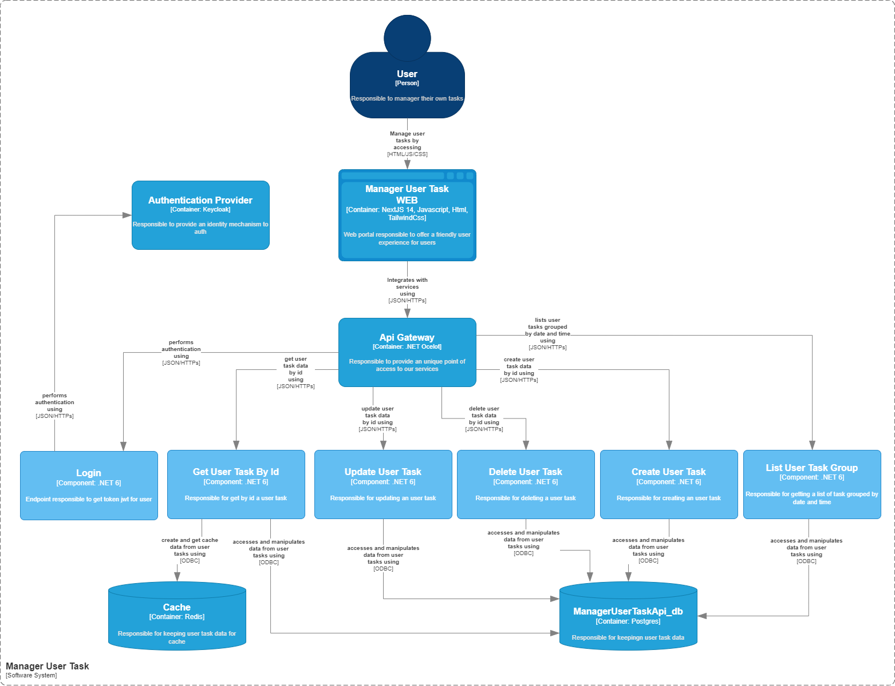

### Technological Overview 
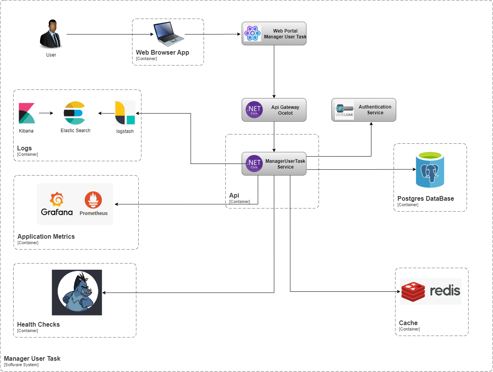

### Solution Structure
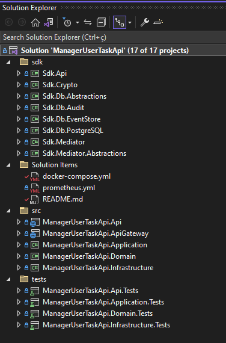


#### Sdk

- **Sdk.Api**
  - Responsible for all API configuration.
- **Sdk.Crypto**
  - Responsible for encrypting and decrypting environment variables.
- **Sdk.Db.Abstraction and Sdk.Db.PostgreSQL**
  - Responsible for encapsulating communication with the database.
- **Sdk.Db.EventStore**
  - Responsible for auditing data dispatch from commands.
- **Sdk.Mediator and Sdk.Mediator.Abstraction**
  - Responsible for encapsulating all MediatR configuration.

#### src

- **ManagerUserTaskApi.Api**
  - Entry point of the application where the controllers are located.
- **ManagerUserTaskApi.ApiGateway**
  - Ocelot Api Gateway route configuration.
- **ManagerUserTaskApi.Application**
  - Contains all commands, events, mappers, and validators.
- **ManagerUserTaskApi.Domain**
  - Contains domain classes, models, requests, responses, and interfaces.
- **ManagerUserTaskApi.Infrastructure**
  - Contains all integrations with databases and external services.

#### tests

- **Unit Tests**
  - Contains the application's unit tests.


--------------------------------------------

### Configure local execution ###

Go to folder manager_user_task_service where is the docker-compose.yml file.

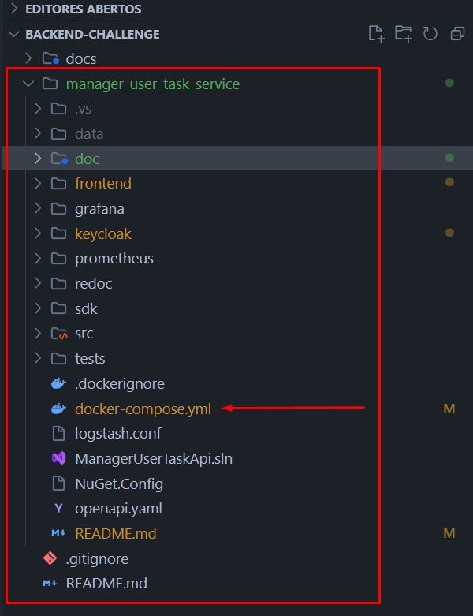


You need up the containers in docker compose file with command bellow.

``` bash
docker-compose up
```
Remember, you need have a [docker-compose] installed in your machine.

After launch, you will see this containers running:

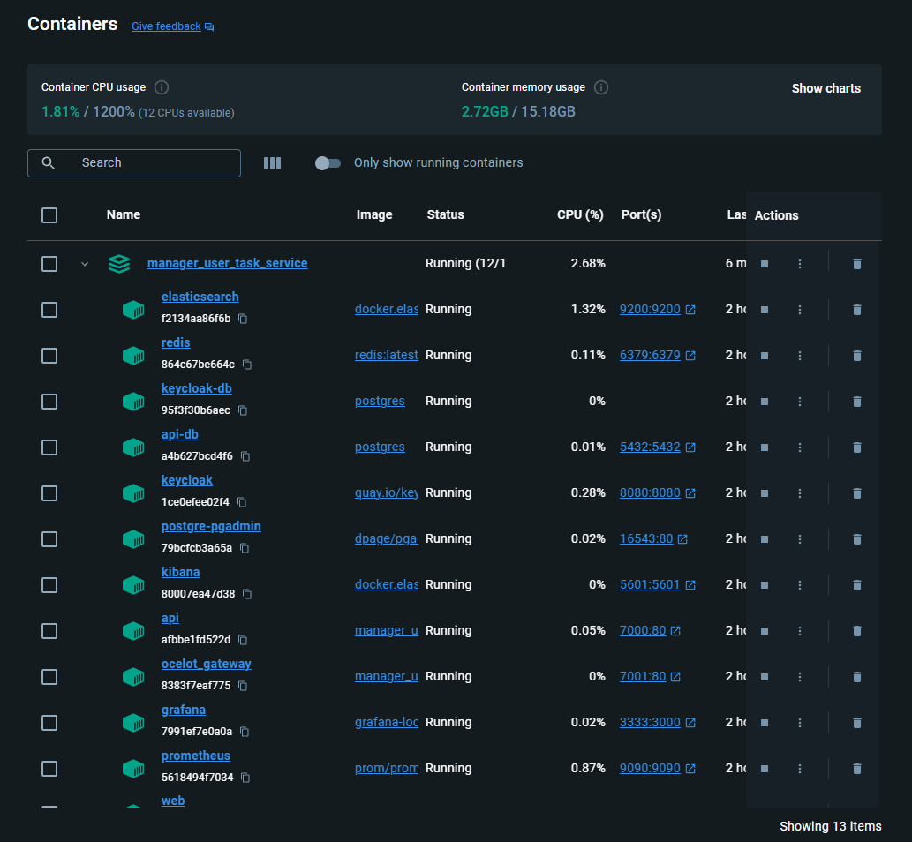

--------------------------------------------

### Access Links bellow ###
- Api Swagger
	- http://localhost:7000/swagger/index.html
  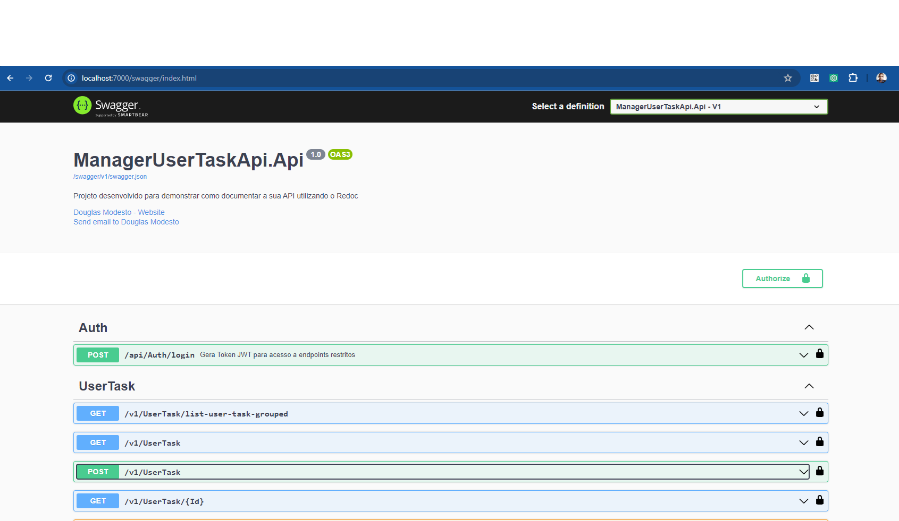
	- Default user to login and get jwt token
		- {
			  "username": "ventureslab",
			  "password": "Teste@123"
		  }
  
- Api Re-Doc
	- http://localhost:7000/api-docs/index.html
  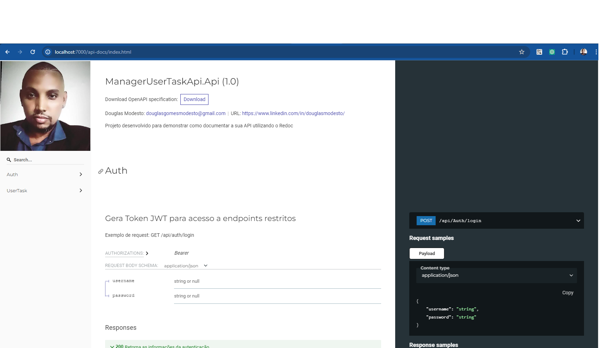

- Api Metrics Prometheus
	- https://localhost:7000/metrics
  - https://localhost:9090
  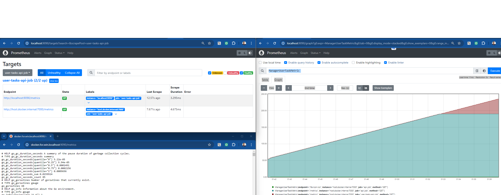

- Kibana
	- http://localhost:5601/app/home
  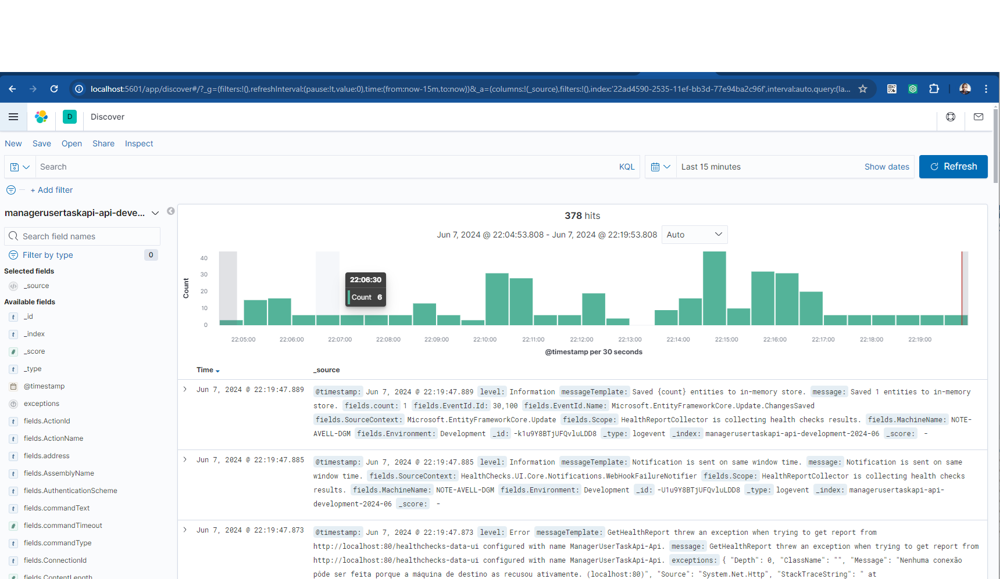

- Healthcheck
	- http://localhost:7000/dashboard#/healthchecks
  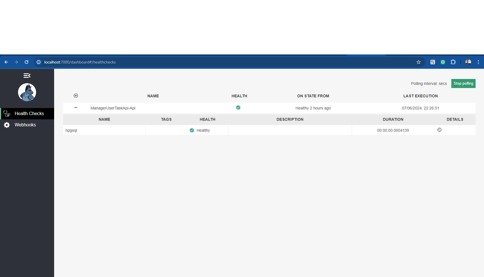

- PgAdmin 
	- http://localhost:16543/login?next=%2Fbrowser%2F
  
  - Login PgAdmin
     - PGADMIN_DEFAULT_EMAIL: "ManagerUserTaskApi@personal.com.br"
     - PGADMIN_DEFAULT_PASSWORD: "ManagerUserTaskApi!@85"
  - Connect in Database:
      - HostName: api-db
      - Port: 5432
      - Database=ManagerUserTaskApi_db
      - Username=default
      - Password=ManagerUserTaskApi!@85

- Keycloak 
	- http://localhost:8080/
  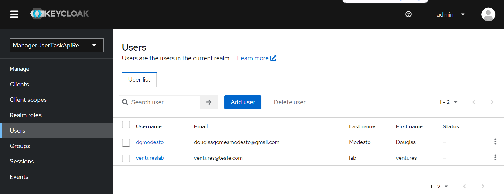
  - Login
		- {
			  "username": "admin",
			  "password": "admin123"
		  }
- Grafana
	- http://localhost:3333/login
  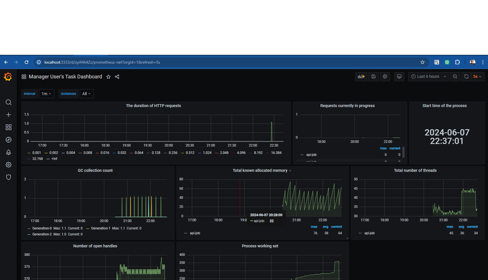
  - Login
		- {
			  "username": "admin",
			  "password": "@admin"
		  }	
- Web Portal
	- http://localhost:3000/login


-----------------------------------------------------------------------

# Screens
### LOGIN DATA
{
  "username": "ventureslab",
  "password": "Teste@123"
}


## Login Page
  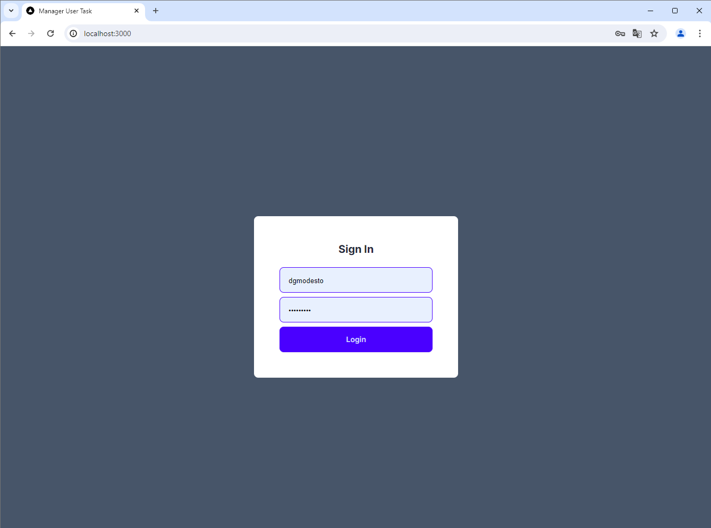

  
## List Page
  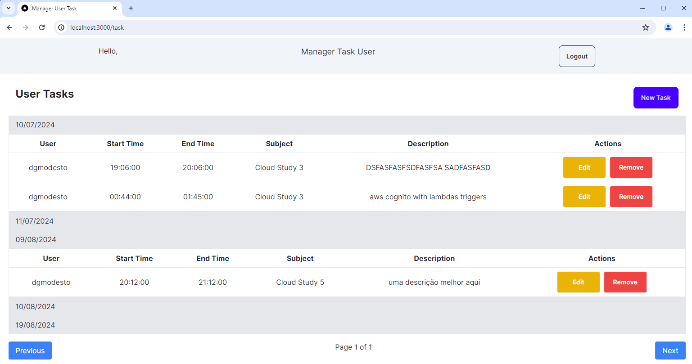


## Register New Task Page
  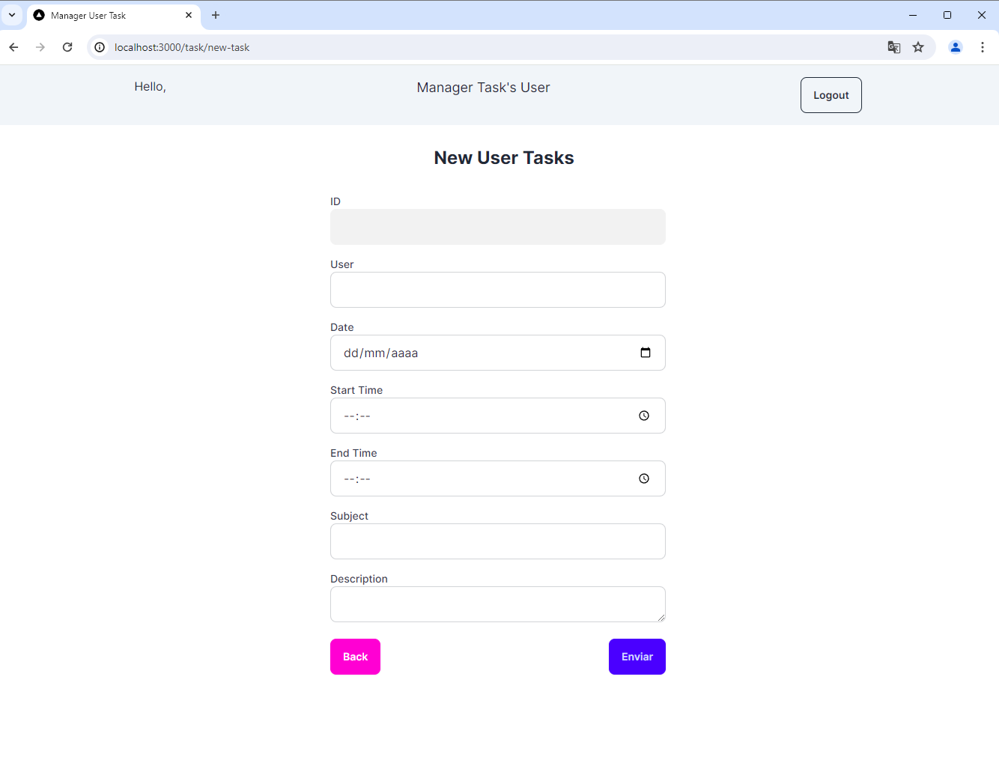


## Update Task Page
  

------------------------------------------------------------------------

