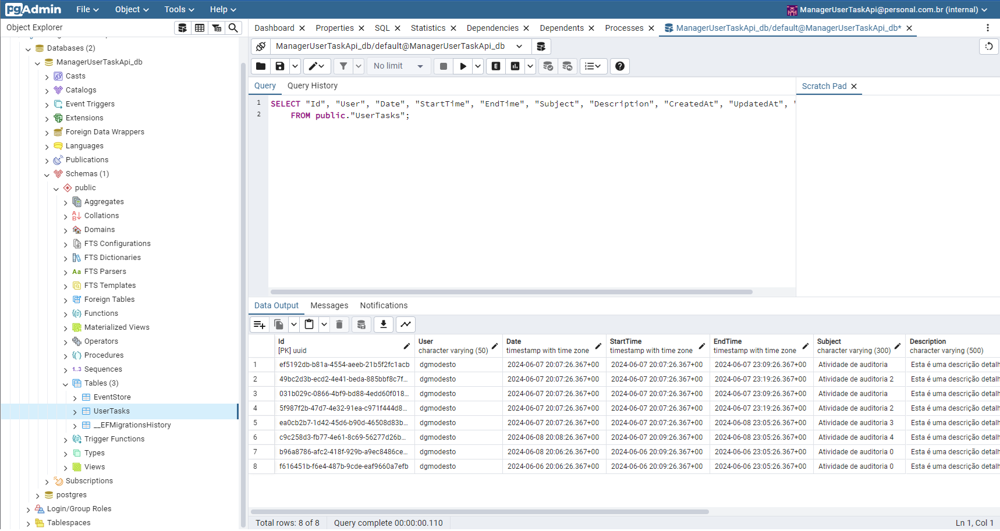
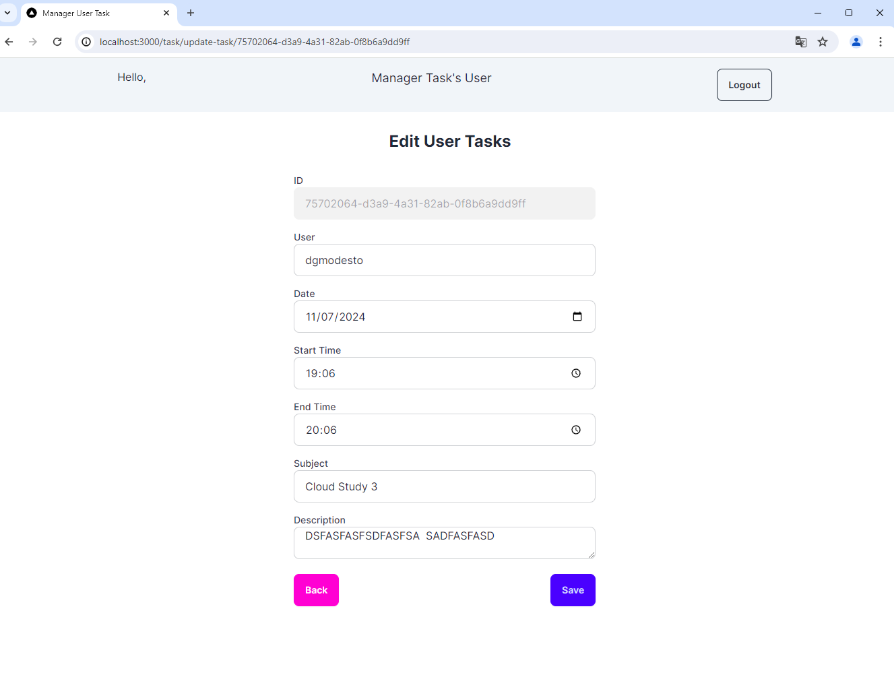

# README #

# Task Management Application

The Task Management Application is a comprehensive tool designed to help users efficiently manage their tasks. This application provides users with the ability to create, edit, and delete tasks, ensuring that they can keep track of their responsibilities and commitments with ease.

## Key Features

1. **Task Creation and Management**
   - Users can create new tasks, specifying important details such as the date, start and end time, subject, and description.
   - Tasks can be easily edited or deleted as needed, allowing users to keep their task list up-to-date and relevant.

2. **Task Organization**
   - Tasks are categorized into two main groups: today's tasks and upcoming tasks.
   - Within these categories, tasks are further organized by date and time, providing a clear and structured overview of the user's schedule.

3. **Detailed Task Information**
   - Each task entry includes the following data:
     - **User:** The individual responsible for the task.
     - **Date:** The specific date on which the task is scheduled.
     - **Start and End Time:** The precise time frame during which the task will be carried out.
     - **Subject:** A brief title or summary of the task.
     - **Description:** A detailed explanation of the task's content and objectives.

## Objective

The primary goal of the Task Management Application is to enhance productivity and organization by providing users with a user-friendly platform to manage their daily and upcoming tasks. By consolidating task management into a single application, users can ensure that they never miss an important deadline or appointment, ultimately leading to better time management and increased efficiency.

This project is aimed at individuals seeking a reliable and intuitive solution to manage their personal and professional tasks. Whether used for work-related responsibilities or personal to-do lists, the Task Management Application is designed to adapt to the needs of every user, offering a seamless and effective way to stay organized and productive.


## Architecture 

### Application View 


### Technological Overview 


### Solution Structure


#### Sdk

- **Sdk.Api**
  - Responsible for all API configuration.
- **Sdk.Crypto**
  - Responsible for encrypting and decrypting environment variables.
- **Sdk.Db.Abstraction and Sdk.Db.PostgreSQL**
  - Responsible for encapsulating communication with the database.
- **Sdk.Db.EventStore**
  - Responsible for auditing data dispatch from commands.
- **Sdk.Mediator and Sdk.Mediator.Abstraction**
  - Responsible for encapsulating all MediatR configuration.

#### src

- **ManagerUserTaskApi.Api**
  - Entry point of the application where the controllers are located.
- **ManagerUserTaskApi.ApiGateway**
  - Ocelot Api Gateway route configuration.
- **ManagerUserTaskApi.Application**
  - Contains all commands, events, mappers, and validators.
- **ManagerUserTaskApi.Domain**
  - Contains domain classes, models, requests, responses, and interfaces.
- **ManagerUserTaskApi.Infrastructure**
  - Contains all integrations with databases and external services.

#### tests

- **Unit Tests**
  - Contains the application's unit tests.


--------------------------------------------

### Configure local execution ###

Go to folder manager_user_task_service where is the docker-compose.yml file.


You need up the containers in docker compose file with command bellow.

``` bash
docker-compose up
```
Remember, you need have a [docker-compose] installed in your machine.

After launch, you will see this containers running:


--------------------------------------------

### Access Links bellow ###
- Api Swagger
	- http://localhost:7000/swagger/index.html
  
	- Default user to login and get jwt token
		- {
			  "username": "ventureslab",
			  "password": "Teste@123"
		  }
  
- Api Re-Doc
	- http://localhost:7000/api-docs/index.html
  

- Api Metrics Prometheus
	- https://localhost:7000/metrics
  - https://localhost:9090
  

- Kibana
	- http://localhost:5601/app/home
  

- Healthcheck
	- http://localhost:7000/dashboard#/healthchecks
  

- PgAdmin 
	- http://localhost:16543/login?next=%2Fbrowser%2F
  
  - Login PgAdmin
     - PGADMIN_DEFAULT_EMAIL: "ManagerUserTaskApi@personal.com.br"
     - PGADMIN_DEFAULT_PASSWORD: "ManagerUserTaskApi!@85"
  - Connect in Database:
      - HostName: api-db
      - Port: 5432
      - Database=ManagerUserTaskApi_db
      - Username=default
      - Password=ManagerUserTaskApi!@85

- Keycloak 
	- http://localhost:8080/
  
  - Login
		- {
			  "username": "admin",
			  "password": "admin123"
		  }
- Grafana
	- http://localhost:3333/login
  
  - Login
		- {
			  "username": "admin",
			  "password": "@admin"
		  }	
- Web Portal
	- http://localhost:3000/login


-----------------------------------------------------------------------

# Screens
### LOGIN DATA
{
  "username": "ventureslab",
  "password": "Teste@123"
}


## Login Page
  

  
## List Page
  


## Register New Task Page
  


## Update Task Page
  

------------------------------------------------------------------------

